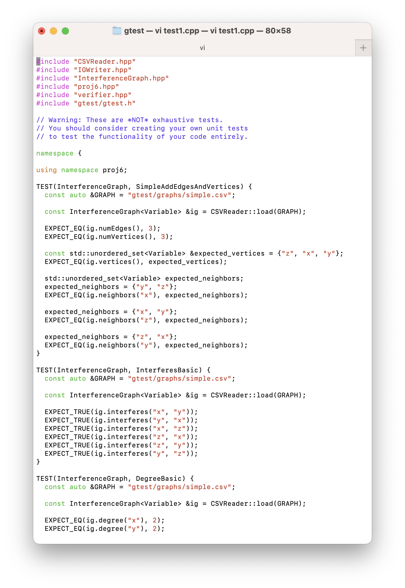
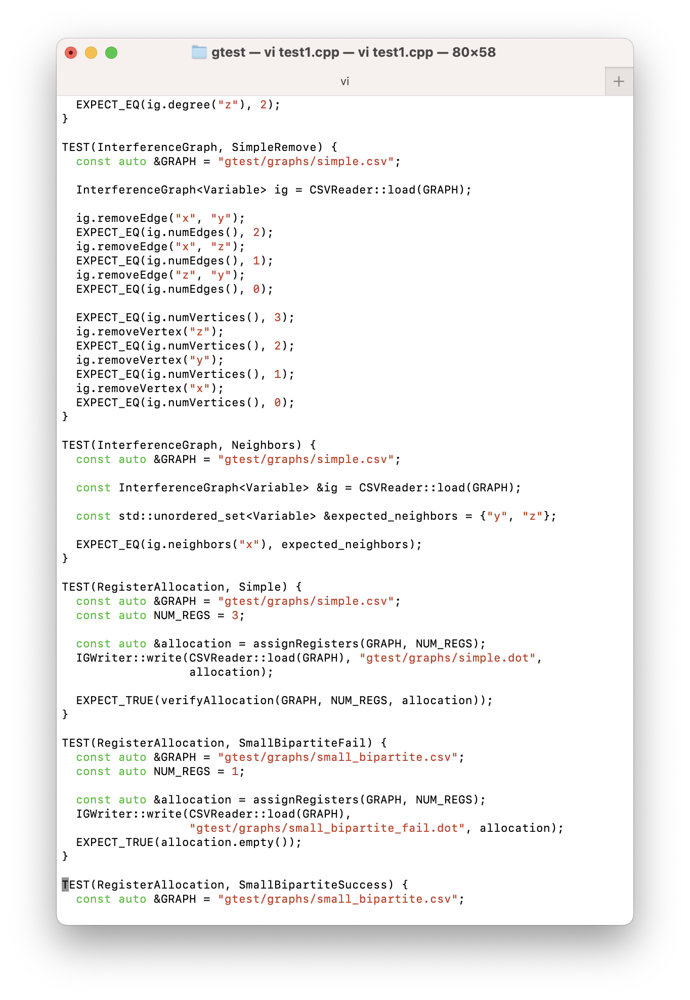
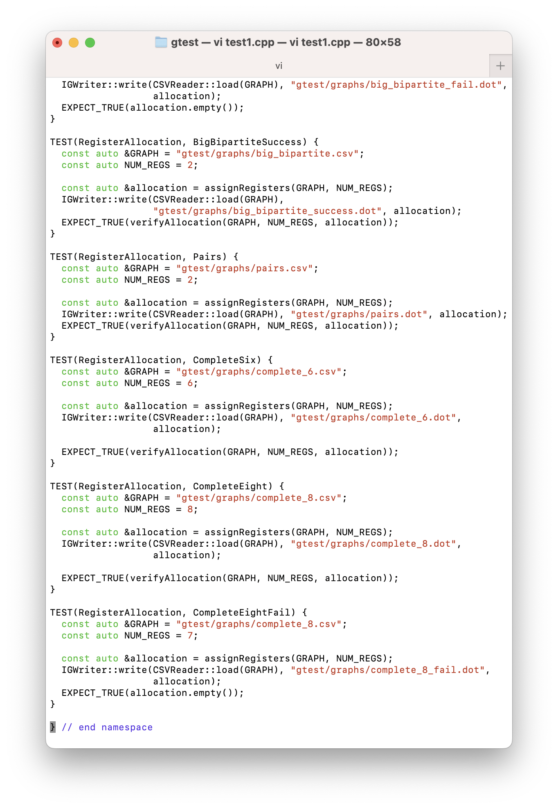
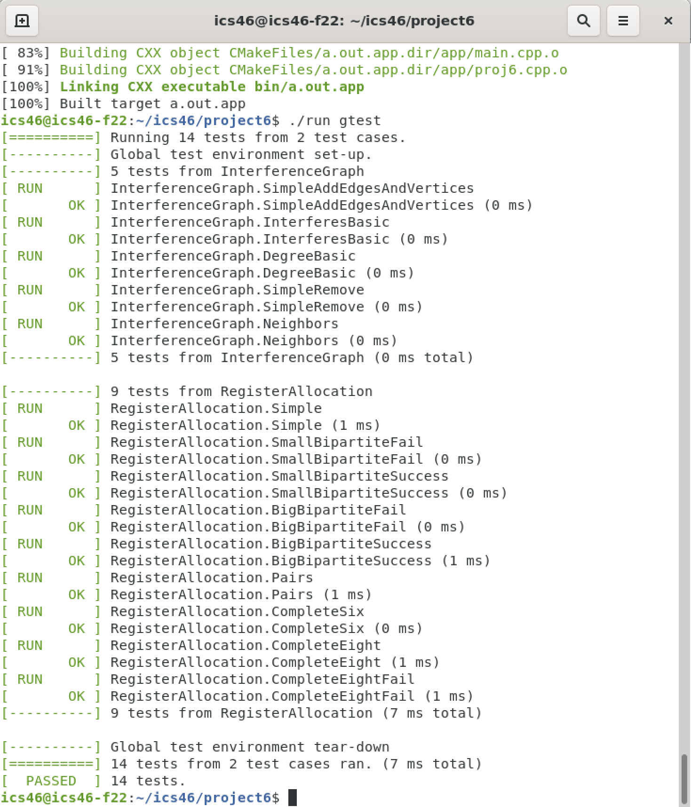

# Project 6: Colorful Graphs

## Learning Objectives

This project was designed with the following high-level goals in mind. As you work on the project, try to make sure you accomplish the following. If you feel like the project was not set up well to support these objectives please feel free to let us know!

- [ ] Make _informed_ design decisions based on knowledge of the data structures learned in this course.
- [ ] Become familiar with the implementation details of a graph data structure by building one.
- [ ] Use an explicit graph data structure to solve a complex, real-world problem.

## Introduction

In projects three and five you most likely used an _implicit_ graph structure
to solve the word ladder problem. Most solutions would have generated neighboring
words on the fly and used some kind of map structure to keep track of the optimal path.
This project will explore the use of an _explicit_ graph structure and will lead
into an elegant solution for the seemingly complex problem of register allocation within compilers.

This project is divided into two parts:

```
Part 1: implement a graph data structure called the interference graph
Part 2: use your graph to solve the register allocation problem via graph coloring
```

### Register Allocation

When your C++ programs are compiled the compiler must choose _where_ variables will be _stored_.

For example, in the following program

```
x = 1;
y = 4;
z = x;
```

variables `x` and `y` _cannot_ map to the same location in memory. If they did, the write `y = 4` would _overwrite_ the value of `x` (which should be 1). The following statement `z = x` would assign `4` to `z`, which is obviously not what the programmer intended.

The compiler _could_ theoretically choose to map each new variable to a new memory location,
but modern processors have certain memory locations which are _faster_ to access than others. These are called _registers_ (which you should learn more about in ICS 51 if you haven't taken it already). The number of available registers is dependent on the processor architecture. For example, if your computer has an x86\_64 processor it has _only_ `8` registers!

Note, the details of how registers work are not important for this assignment. The important motivational piece of information is that there are a _limited_ number of registers available to the compiler. The compiler's job (and yours in this assignment) is to figure out how to _effectively_ use the limited number of registers available to it.

### Example

Program:

```
x = 1;
y = 4;
z = x;
```

An _inefficient_ allocation of registers (assuming we have access to up to eight registers) would look like:

```
x -> Register 1
y -> Register 2
z -> Register 3

Total registers used: 3
```

An _efficient_ allocation of registers would look like:

```
x -> Register 1
y -> Register 2
z -> Register 1

Total registers used: 2
```

The key insight here is that variable `x` and variable `z` can be stored in the same register, because the value of `x` is _not used_ after the assignment to `z` (assuming this snippet represents the entirety of our program).

Don't worry if this problem seems complicated if not impossible to solve at first. You won't be reponsible for coming up with a novel solution on your own. Instead, we're going to leverage Gregory Chaitin's work from 1981 [1]. Chaitin observed that is problem is actually the same as the _graph coloring problem_ we saw in lecture (!!) if you frame it the right way.

### Interference Graph

This new framing of the problem uses the idea of an _interference graph_ [2]. An _interference graph_ is an _undirected_ graph where the nodes are variables and edges between them represent overlapping _lifetimes_. A variable _lifetime_ is the duration for which the value stored in a variable must _live_. Let's take a look at a few examples.

### Example


A program represented by the above interference graph has lifetimes overlapping for three variables: `x`, `y`, and `z`. This means `x`, `y`, and `z` _must be mapped to different registers_. This should remind you of the graph coloring problem almost exactly.

Building the interference graph itself is a topic for a compilers class, so instead you
will be _given_ the interference graph in the form of a _CSV file_ (comma separated values), like so for the above graph:

```
simple.csv

x,y
y,z
z,x
```

Each line in the interference graph represents an edge in the graph. To keep things simple, only edges can be expressed in the CSV, not lone vertices.

There is a pre-written function `load()` in `CSVReader` which will parse the CSV file and add the nodes to your graph structure:

```
InterferenceGraph<Variable> CSVReader::load(const std::string &graph_path) {

  InterferenceGraph<Variable> ig;
  std::string line;
  std::ifstream file_stream(graph_path);

  while (std::getline(file_stream, line)) {
    const auto &edge = readEdge(line);
    ig.addVertex(edge.first);            // implemented by YOU
    ig.addVertex(edge.second);           // implemented by YOU
    ig.addEdge(edge.first, edge.second); // implemented by YOU
  }

  return ig;
}
```

## Part 1: Interference Graph

The first part of project 6 will be the implementation of the interference graph data structure. You are free to use any underlying format for your graph such as an adjacency list, adjacency matrix, or edge list. The most important interface will be getting the neighbors of a node, so consider a structure that makes this operation fast. As mentioned in the Implemenation Restrictions section, you are allowed to use anything from the standard library, and any prior code you have written for this course. Thus, you should spend most of your time thinking about which structures to use.

The difficulty of this part will depend on the data structures you use to store the nodes and edges of the graph. I recommend thinking deeply about the data structures studied in the course, and having a plan before starting. This part _should_ be relatively easy compared to other data structures implemented in this course.

### Requirements

- [ ] Even though it is templated, your graph implemenation will only be tested with strings.
- [ ] All design decisions with respect to the graph implementation should be _yours_. This project is focused on thinking about trade-offs and incorporating all prior knowledge from the course.
- [ ] You must implement the following functions as described. Remember that you should not modify the prototypes of these functions at all, as we will be calling them in the tests.

`InterferenceGraph()`

The constructor for the `InterferenceGraph` class. Member data should be initialized here if needed.

`~InterferenceGraph()`

Destructor for the `InterferenceGraph` class. You are explicitly allowed to use anything from the standard library. However, if you choose to use your own linked list implementation to store the neighbors you will need to deallocate the dynamically allocated memory.

`void addEdge(const T &v, const T &w)`

This function will be called in the `load()` function, once for each line in the corresponding CSV file. This function should add an **undirected** edge between `v` and `w`, representing an "interference" between the variable `v` and variable `w`. You can assume that the test cases will never attempt to insert duplicate edges such as both "x,y" and "y,x". If either `v` or `w` is not present in the graph, you should throw an `UnknownVertexException`.

`void addVertex(const T& vertex) noexcept`

Called in the `load()` function twice per line of the CSV, once for each vertex in the corresponding edge. Simply adds a vertex with no neighbors to your graph. If the vertex already exists in the graph you should _NOT_ erase the neighbors of the vertex, you can just simply return. The contract with the caller is that `vertex` will exist in the graph after the call.

`void removeEdge(const T& source, const T& destination)`

This function should remove an **undirected** edge from your interference graph. If the edge doesn't exist you should throw an `UnknownEdgeException`. If either of the vertices aren't
in the graph you should throw an `UnknownVertexException`.

`void removeVertex(const T& vertex)`

Removes a vertex from your interference graph. After this function is run the vertex should not exist in the graph at all. If the vertex does not exist you should throw an `UnknownVertexException`.

`std::unordered_set<T> vertices() const noexcept`

Simply returns a set with all vertices in it.

`std::unordered_set<T> neighbors(const T& vertex) const`

Returns a set containing all the neighbors of a given vertex. If the vertex is not
present in the graph, you should throw an `UnknownVertexException`. In practice, you will often see an iterator returned here instead. However, for the sake of keeping the assignment a little simpler, an `unordered_set` works as well.

`unsigned numVertices() const noexcept`

Returns the number of vertices in the graph. Should run in constant time.

`unsigned numEdges() const noexcept`

Returns the number of undirected edges in the graph. Should run in constant time.

`bool interferes(const T& v, const T& w) const`

Returns true if there is an interference between vertex `v` and vertex `w`. If either `v` or `w` are not in the graph you should throw an `UnknownVertexException`.

`unsigned degree(const T& v) const`

Return the degree of vertex `v`. If it doesn't exist in the graph you should throw an `UnknownVertexException`.

### GTest Example


The above interference graph is stored in `gtest/graphs/simple.csv` as:

```
x,y
z,x
z,y
```

This test will open `simple.csv`, call `load()`, and check the `InterferenceGraph` that you built.

```
TEST(InterferenceGraph, SimpleAddEdgesAndVertices) {
  const auto &GRAPH = "gtest/graphs/simple.csv";

  const InterferenceGraph<Variable> &ig = CSVReader::load(GRAPH);

  EXPECT_EQ(ig.numEdges(), 3);
  EXPECT_EQ(ig.numVertices(), 3);

  const std::unordered_set<Variable> &expected_vertices = {"z", "x", "y"};
  EXPECT_EQ(ig.vertices(), expected_vertices);

  std::unordered_set<Variable> expected_neighbors;
  expected_neighbors = {"y", "z"};
  EXPECT_EQ(ig.neighbors("x"), expected_neighbors);

  expected_neighbors = {"x", "y"};
  EXPECT_EQ(ig.neighbors("z"), expected_neighbors);

  expected_neighbors = {"z", "x"};
  EXPECT_EQ(ig.neighbors("y"), expected_neighbors);
}
```

## Part 2: Register Allocation

In this part you will be solving the register allocation problem using your new `InterferenceGraph` structure. You will be given the pseudocode needed to solve the graph coloring problem, but you are responsible for mapping it to the register allocation problem illustrated above in the introduction. Mapping solutions from one problem to another is a very useful skill that will serve you well in your programming career. This is sometimes called a "reduction". For example, you'll often hear the register allocation "reduces" to graph coloring.

`RegisterAssignment assignRegisters(const std::string &path_to_graph, int num_registers) noexcept`

**Input**

`path_to_graph`: A string path to the graph we will be allocating registers for. The first thing your implementation should do is load this string into an InterferenceGraph using CSVReader::load(). This has already been done for you.

`num_registers`: The maximum number of registers you are allowed to use. IMPORTANT: your register allocation algorithm should use registers [1, num_registers] inclusive. You can think of this as the number of registers available on the processor. This number will always be in the range [1, 100] (inclusive).

**Output**

`RegisterAssignment`: An `unordered_map<string, int>` type which is the mapping of each variable in the graph to a register in the range [1, num_registers] that solves the register allocation problem mentioned above.
Of the available registers, you should only use d(G) + 1 unique registers where d(G) is defined as the largest degree in the graph G (here G is the interference graph provided via the `path_to_graph` parameter). Your assignment should meet the requirements mentioned in the "Register Allocation Requirements" section.

As stated previously, you will be basing your implementation off of a graph coloring algorithm. The algorithm you will be adjusting is the Welsh-Powell Algorithm from 1967 (!!) [3]. Isn't it cool that an algorithm developed for something completely different can be used up to 20 years later in a new domain? :)

Welsh-Powell Graph Coloring:

1. All vertices should be sorted in descending order according to their degree.
2. Colors should be sorted in a list `C`.
3. The first non-colored vertex `v` in `V` is colored with the first available color in `C`. "Available" means a color that was not previously used by the algorithm.
4. The remaining part of the ordered list `V` is traversed and the same color is allocated to every vertex for which no adjacent vertex has the same color.
5. Steps 3 and 4 are applied iteratively until all the vertices have been colored.

It is highly recommended that you use this algorithm, but you don't HAVE to if you like another one better. However, you MUST use AT MOST `d(G) + 1` registers where `d(G)` represents the largest degree in the graph `G`.

If the interference graph cannot be allocated, you should return an empty map.
For example, if the interference graph has two vertices with an edge between
them, but there is only one register available.

### Requirements

There is a function `verifyAllocation` provided in `verifier.cpp` which will verify the correctness of your register allocation algorithm. The implementation is open for you to view.
These are the requirements:

1. Each variable must be mapped to a register in the range [1, num_registers] inclusive.
2. If a variable `v` is a neighbor of variable `w` in the interference graph they cannot share the same register.
3. **You may only use at most `d(G) + 1` registers**, even if you are given more via `num_registers`. Here, `d(G)` is defined has the highest degree in the graph G (the interference graph provided). Note, the provided algorithm accomplishes this.

You _should_ get helpful error messages if you don't meet one of the requirements. If not,
feel free to post on EdStem as a private message.

### GTest Example

```
TEST(RegisterAllocation, Simple) {
  const auto &GRAPH = "gtest/graphs/simple.csv";
  const auto NUM_REGS = 3;

  const auto &allocation = assignRegisters(GRAPH, NUM_REGS);
  IGWriter::write(CSVReader::load(GRAPH), "gtest/graphs/simple.dot",
                  allocation);
  EXPECT_TRUE(verifyAllocation(GRAPH, NUM_REGS, allocation));
}
```

This GTest calls `assignRegisters` (which you will implement) on the graph "gtest/graphs/simple.csv", which looks like the following:

```
x,y
z,x
z,y
```

or, visually:


A proper register allocation for this graph must assign a unique register to each variable,
since all nodes are connected to each other. Thus something like,

```
RegisterAssignment

x -> 1
y -> 2
z -> 3
```

would work well. Since d(G) = 2 for the above graph, and d(G) + 1 = 3, we can use up to three
unique registers. Our assignment does just that.

### Screenshots




